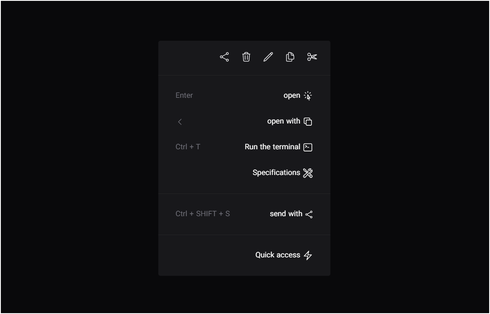

# Custom Context Menu

A sleek, modern **custom right-click context menu** built with **HTML, CSS, and JavaScript**.  
This project replaces the default browser context menu with a customizable, visually appealing menu that can include sections, headers, and footer buttons.



## Features

- Fully custom right-click context menu
- Blur and transparency effects for modern UI
- Supports headers, main sections, and footer buttons
- Keyboard support: close menu with `Escape` key
- Smooth hover effects
- Easy to extend and style

## Demo Video

Check out the demo of the context menu in action:

[Watch Demo](public/img/Screen%20Recording.mp4)

## Installation

1. Clone this repository:

```bash
git clone https://github.com/00mohammad/custom-contextmenu.git
